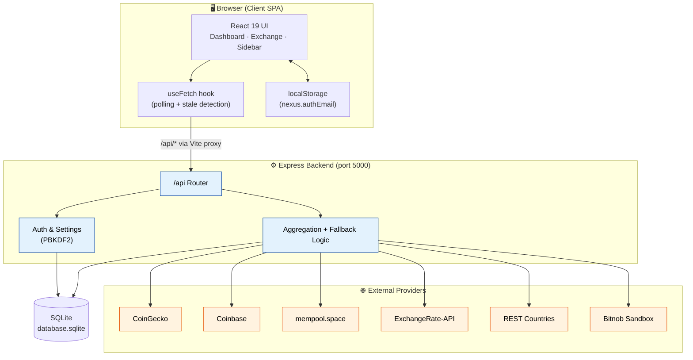
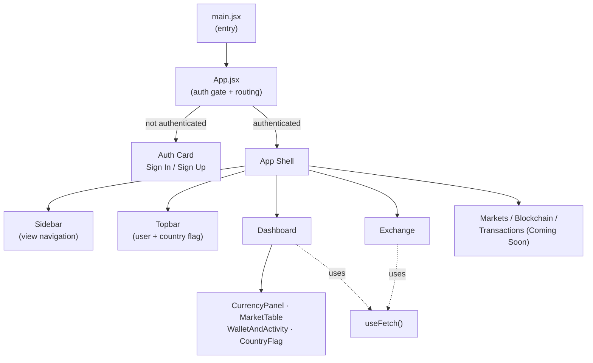
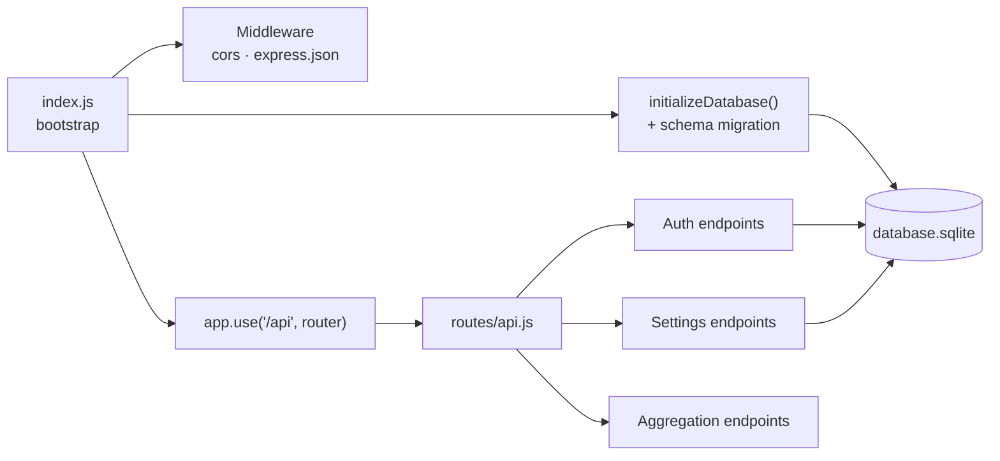
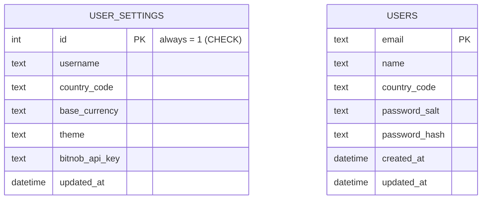
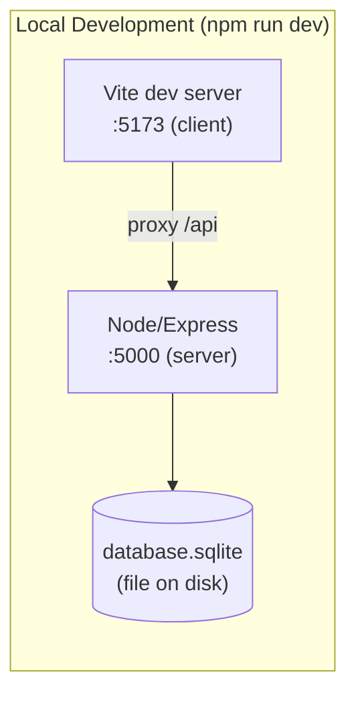

# Nexus Financial Intelligence — System Architecture

> **Project 1 of 3 — Unified API Integration (Currency Tracker)**
> A full-stack financial dashboard that unifies crypto prices, fiat exchange rates, Bitcoin network data, country metadata, and Bitnob payout capabilities behind a single, resilient backend API.

---

## 1. Overview

Nexus Financial Intelligence is a two-tier web application:

- A **React (Vite) single-page client** that renders a "light terminal" financial dashboard.
- An **Express + SQLite backend** that acts as a **unified API gateway**, aggregating five external data sources behind one clean `/api` surface and adding local user accounts and settings.

The defining architectural idea is **resilient aggregation**: the client never talks to third-party APIs directly. Instead, the backend fans out to upstream providers and guarantees a usable response through a layered fallback strategy (primary provider → secondary provider → offline mock data). The UI therefore always has something to render, even fully offline.

| Attribute | Value |
|---|---|
| Architecture style | Client–server SPA + API gateway / Backend-for-Frontend (BFF) |
| Frontend | React 19, Vite 8 |
| Backend | Node.js, Express 4 |
| Persistence | SQLite (single-file DB) via `sqlite3` |
| External integration | Axios HTTP client |
| Auth | Local email/password, PBKDF2 hashing (`crypto`) |
| Dev orchestration | `concurrently` (server + client together) |

---

## 2. High-Level Architecture

**Key point:** In development, the Vite dev server proxies every `/api/*` request to `http://localhost:5000`, so the browser sees a single origin and there are no CORS issues from the app's own perspective. CORS is also enabled server-side for flexibility.

---

## 3. Technology Stack

| Layer | Technology | Role |
|---|---|---|
| **Client framework** | React 19 + Vite 8 | SPA rendering, fast dev server, `/api` proxy |
| **Client data layer** | Custom `useFetch` hook | Loading/error state, polling intervals, "stale/offline" detection |
| **Backend runtime** | Node.js + Express 4 | HTTP server, routing, middleware |
| **HTTP client** | Axios | Outbound calls to external providers, per-call timeouts |
| **Database** | SQLite (`sqlite3`) | User accounts + single-row settings |
| **Auth/crypto** | Node `crypto` (PBKDF2-SHA512, 120k iterations) | Password hashing + timing-safe comparison |
| **Config** | `dotenv` | API keys, environment (`BITNOB_ENV`, `BITNOB_API_KEY`) |
| **Dev tooling** | `concurrently` | Run server + client with one command |

---

## 4. Component Breakdown

### 4.1 Frontend (`client/`)

- **`App.jsx`** is the application root. It performs an **auth-gate** pattern: on boot it loads `/api/countries` and, if `nexus.authEmail` exists in `localStorage`, rehydrates the user via `/api/auth/user/:email`. Until a user is present it renders the Sign In / Sign Up card; afterward it renders the dashboard shell.
- **Client-side "routing"** is a simple `activeView` state switch (`dashboard`, `markets`, `exchange`, `blockchain`, `transactions`) — no router library. Several views are intentional "Coming Soon" placeholders.
- **`useFetch`** centralizes all data fetching: it exposes `{ data, loading, error, isStale, refetch }`, supports an optional polling `interval`, and flags data as **stale** when the backend response's `source` field contains `"Offline"` or `"Mock"` — surfacing the fallback state to the user.
- **Session model:** there is no token. "Being logged in" means the user's email is in `localStorage` and re-fetched on load. This is a demo-grade session, not a secure one (see §8).

### 4.2 Backend (`server/`)

- **`index.js`** boots Express, opens the SQLite file, runs `initializeDatabase()`, exposes the DB handle on `app.set('db', …)` so routes can retrieve it via `req.app.get('db')`, mounts the `/api` router, and serves a plain health string at `/`.
- **`routes/api.js`** contains all endpoints plus two in-memory reference tables: `SUPPORTED_COUNTRIES` (NG, KE, GH, RW, UG) and `MOCK_BITNOB_CAPABILITIES` (per-country payout channels, fees, limits, settlement).
- **Schema self-healing:** `ensureUserSettingsColumns()` runs `PRAGMA table_info` and `ALTER TABLE` to add missing columns — a lightweight forward migration so older DB files keep working.

---

## 5. Data Model (SQLite)

- **`user_settings`** is a **singleton row** (`CHECK (id = 1)`) — global app configuration rather than per-user. It stores the active Bitnob API key, which takes precedence over the `.env` key at request time.
- **`users`** holds accounts. Passwords are never stored in plaintext: each row keeps a random per-user salt and a PBKDF2-SHA512 hash. `publicUserRow()` strips salt/hash before any user object leaves the server and enriches it with country metadata (flag, currency).

---

## 6. Cross-Cutting Concerns

### Resilience
- Per-call Axios **timeouts** (4–5s) prevent a slow upstream from hanging the app.
- **Three-tier fallback** (primary → secondary → mock) on every external call.
- **Stale-data signaling** via the `source` field, surfaced by `useFetch`.

### Security (current state & gaps)
- ✅ Passwords hashed with **PBKDF2-SHA512, 120k iterations**, per-user salt, **timing-safe** comparison.
- ✅ Server strips `password_hash`/`password_salt` from all responses.
- ⚠️ **No session tokens / JWT** — "auth" is an email string in `localStorage`; `/auth/user/:email` returns a profile for any known email with no secret. Suitable for a demo, not production.
- ⚠️ **Bitnob API key stored in plaintext** in SQLite `user_settings`.
- ⚠️ Settings are a **global singleton**, not per-user — the saved API key/theme is shared app-wide.

### Configuration
- `.env` (via `dotenv`) supplies `PORT`, `BITNOB_API_KEY`, `BITNOB_ENV`. `.env.example` documents the shape.

---

## 7. Deployment & Runtime Topology

- **One command** (`npm run dev` at the root) uses `concurrently` to launch the Express server and the Vite client together.
- SQLite is a **local file** (`server/database.sqlite`), created and migrated automatically on first boot — no external DB service to provision.
- For production, the client would be built (`vite build`) to static assets and served behind the Express API (or a CDN), with the same `/api` contract.

---

## 8. Design Decisions & Trade-offs

| Decision | Rationale | Trade-off |
|---|---|---|
| Backend-for-Frontend gateway | Hide API keys, unify disparate provider schemas, sidestep browser CORS/rate limits | Extra hop; backend must be running |
| Three-tier fallback + mock data | App is always demoable, even offline | Mock data can silently mask real outages (mitigated by the `source`/`isStale` badge) |
| SQLite single file | Zero-config persistence, trivial local setup | Not built for concurrent/high-scale writes |
| Singleton settings row | Simple global config for a demo | No per-user preferences |
| `localStorage` email as session | Minimal code for a demo login | Not secure — no real session management |
| No client router | Fewer dependencies for a small app | Manual view switching won't scale to deep linking |
